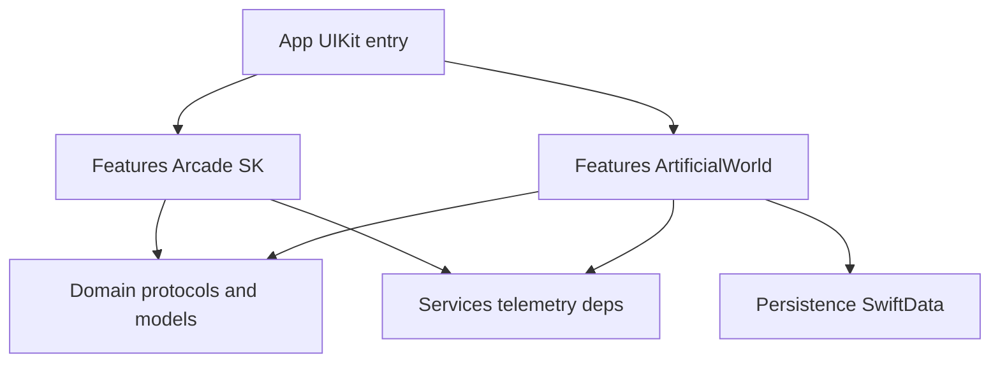

# Artificial World — FASE 0: inventario y arquitectura

Este documento fija el inventario técnico de la raíz del proyecto, la arquitectura actual del arcade y la reestructura objetivo para **Artificial World** como sistema principal.

## Inventario raíz

| Ruta | Rol |
|------|-----|
| `Atrapa un cuadrado.xcodeproj/` | Xcode 16+/objectVersion 77, grupo sincronizado con `Atrapa un cuadrado/` |
| `Atrapa un cuadrado/App/` | Punto de entrada UIKit (`AppDelegate`, `SceneDelegate`, `GameViewController`) |
| `Atrapa un cuadrado/Networking/` | Contratos de sync futuros (`WorldSyncProtocols`) sin cliente HTTP |
| `Atrapa un cuadrado/Domain/` | Modelos y protocolos sin SpriteKit |
| `Atrapa un cuadrado/Core/` | Configuración y perfiles de modo arcade |
| `Atrapa un cuadrado/Features/Arcade/` | Flujo SpriteKit del producto arcade histórico |
| `Atrapa un cuadrado/Features/ArtificialWorld/` | Modo mundo persistente (MVP) |
| `Atrapa un cuadrado/Persistence/` | Implementaciones de repositorios (SwiftData) |
| `Atrapa un cuadrado/Services/` | Telemetría, dependencias de escena |
| `Atrapa un cuadrado/Managers/`, `Models/`, `Entities/`, `UI/`, `Utilities/` | Código compartido o pendiente de migración gradual a Features |

## Arquitectura actual (arcade)

- **Bucle:** `GameScene.update` (SpriteKit), delta acotado, estado local `.active` / `.pausedMenu` / `.gameOver`.
- **Input:** toque → objetivo o joystick virtual; sin `SKPhysicsWorld`.
- **Persistencia metajuego:** `SaveManager` + `UserDefaults` + JSON (`GameProgress`).
- **Acoplamiento:** escenas heredan `BaseScene` con servicios inyectables vía `SceneDependencies` (valor por defecto `.live`).

## Dependencias entre capas (objetivo)

## ADR — persistencia local (Artificial World)

- **Decisión:** SwiftData para estado de mundo, inventario, vitales y memoria resumida del agente.
- **Alternativa:** JSON en Application Support detrás del mismo `WorldRepository` (útil para tests).
- **No:** blobs grandes en `UserDefaults`.

## ADR — backend futuro

- Contratos en `Domain/Protocols/` (`AuthSessionProviding`, `WorldRepository`, `AgentMemoryStore`, `TelemetryLogging`).
- Sin URLs ni clientes HTTP en Domain; la app implementará o dejará no-op hasta integración real.

## Qué no se rompe

Los tres modos **Clásico**, **Arsenal** y **Fantasma** siguen en `GameScene` con el mismo flujo `ModeSelectScene` → `MainMenuScene` → partida. **Artificial World** es la cuarta tarjeta en la misma `ModeSelectScene` y abre `ArtificialWorldScene` sin pasar por el menú arcade.

## Arranque UI (sin storyboard de menú)

- `Info.plist` usa `UIApplicationSceneManifest` con `SceneDelegate`.
- `SceneDelegate` crea la ventana en código, instancia `GameViewController` como `rootViewController` y llama a `ArtificialWorldPersistence.bootstrapIfNeeded()` al conectar la escena.
- `GameViewController` monta un `SKView` a pantalla completa y, en `viewDidAppear`, presenta **`ModeSelectScene`**: mismas tres rutas arcade (Clásico, Arsenal, Fantasma) que antes, más la cuarta tarjeta **Artificial World** (sin hub intermedio).

## Lógica de tick testeable

- `Features/ArtificialWorld/ArtificialWorldSimulation.swift` concentra fórmulas de refugio, regeneración/decay, coste de mejora, radio de captura y multiplicador de velocidad, sin SpriteKit. La escena sigue orquestando nodos y temporizadores.

## SwiftData y campos nuevos

- Si se añaden propiedades al modelo persistido (p. ej. `unlockedAbilitiesData`), conviene probar en dispositivo/simulador limpio o planificar migración ligera; de lo contrario un almacén antiguo puede fallar al cargar hasta reinstalar o resetear datos de la app.

## Arcade lanzado desde el mundo

- `ArtificialWorldScene` pone `ArcadeWorldBridge.returnToArtificialWorldAfterRun = true` antes de presentar `GameScene`.
- En `GameOverScene`, **Menú** con ese flag aplica bonus de monedas, limpia el flag y vuelve a `ArtificialWorldScene`. **Reintentar** no toca el flag: la siguiente partida sigue pudiendo volver al mundo al terminar.

## Referencias de código clave

- Arcade: `Features/Arcade/Scenes/GameScene.swift`
- Entrada menú: `Features/Arcade/Scenes/ModeSelectScene.swift`
- Mundo nuevo: `Features/ArtificialWorld/ArtificialWorldScene.swift`
- Temporizadores arcade extraídos: `Features/Arcade/ArcadeRunTimers.swift`
- Dependencias de escena: `Services/SceneDependencies.swift`
- SwiftData: `Persistence/ArtificialWorldPersistence.swift`, `Persistence/SwiftDataWorldRepository.swift`
- Telemetría debug: `Services/AppTelemetry.swift`
- Puntos backend (stubs): `Services/BackendIntegrationStubs.swift`
- Selector y preferencias: `Features/Arcade/Scenes/ModeSelectScene.swift`, `Services/AppLaunchPreferences.swift`
- Simulación pura (tests): `Features/ArtificialWorld/ArtificialWorldSimulation.swift`
- Vuelta arcade→mundo: `Services/ArcadeWorldBridge.swift`
- Sync futuro: `Networking/WorldSyncProtocols.swift`

## Refactor documentado (arcade)

- **Bucle dificultad/spawn:** la acumulación de temporizadores y el escalado de ronda/ritmo pasan por `ArcadeRunTimersState`; `GameScene` solo orquesta SpriteKit y efectos.
- **Servicios:** `BaseScene` recibe `SceneDependencies` (por defecto `.live`); no cambia el comportamiento del juego existente.
